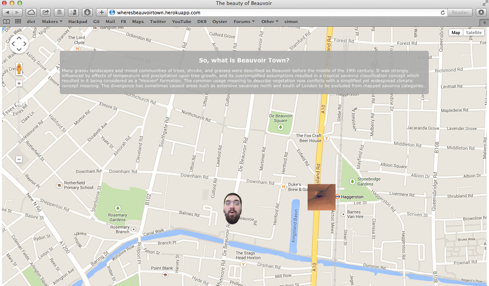

Where is Beauvoir
===
Playing around with the Google API and Javascript to answer a question Nico has been asked many times. Where is Beauvoir Town?


Heroku
----
[App on Heroku]

Objectives of exercise 
----
Familiarizing with a novel API and learning to transform it into a working Heroku app while having a few good laughs.

Technologies used
----
- Javascript
- Sinatra
- HTML5
- CSS3
- Git
- Heroku
- [Google Maps API]

How to run it 
----
```sh
git clone git@github.com:NicoSa/Where-is-Beauvoir-.git
cd Where-is-Beauvoir-
rackup
```
Pairing Partners
----
[Nico],[Oliver]
[App on Heroku]:http://wheresbeauvoirtown.herokuapp.com
[Nico]:https://github.com/NicoSa
[Oliver]:https://github.com/odelevingne
[Google Maps API]:https://developers.google.com/maps/
